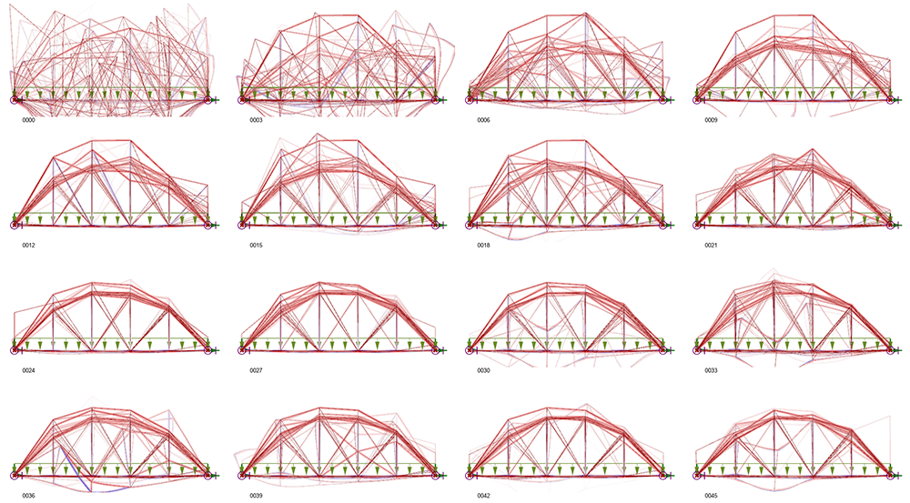

# process_images
Script for generating multi-image composites from design screenshots output during optimization.

Available parameters are:
- mode - (transparency, multiply*, darken*) overlay mode for images
- blend - (float) blend factor for multiply and darken blending modes, where 1.0 is most blended (darkest image) and 0.0 is least blended (no effect)
- gen_size - (int) number of designs per generation (number of designs to merge into single image)
- gen_stride - (int) number of generations to skip
- des_stride - (int) number of designs to skip
- make_index - (True/False) make a single grid layout with all composite images
- aspect - (float) target (w/h) aspect ratio for index image

*for best results with the multiply and darken blending modes, images should have a white background

### Dependencies:

Python 2.7: https://www.python.org/ftp/python/2.7.14/python-2.7.14.msi
numpy: http://www.numpy.org/
Pillow: https://pillow.readthedocs.io/en/5.1.x/

If you don't want to run directly through Python or install the dependencies, a built .exe version is included in the `/dist` folder.

